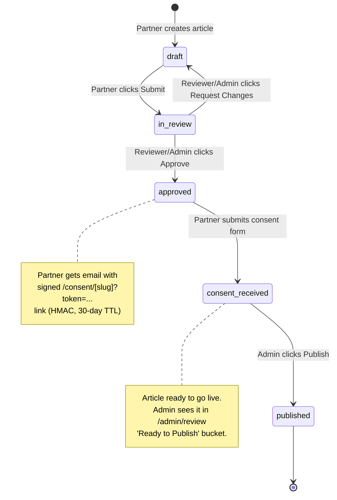
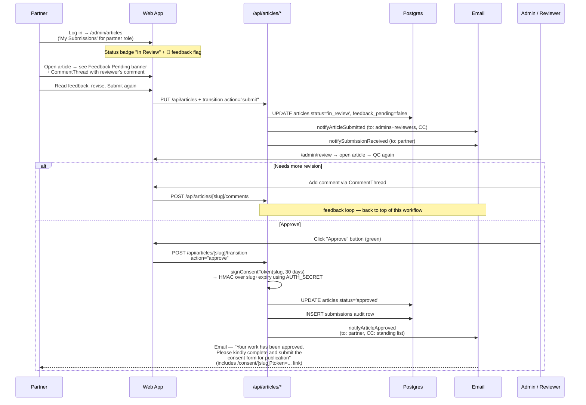
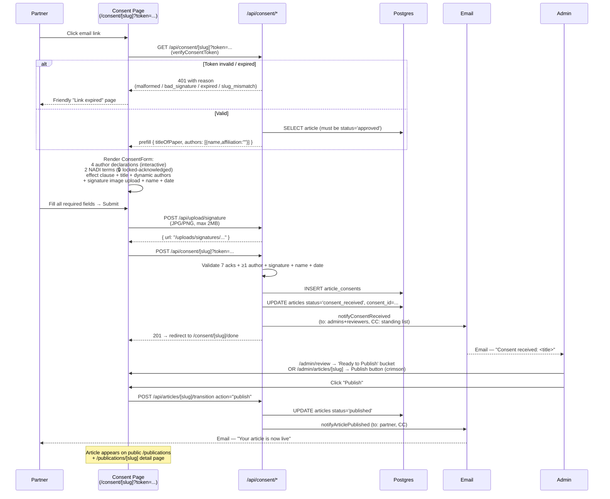
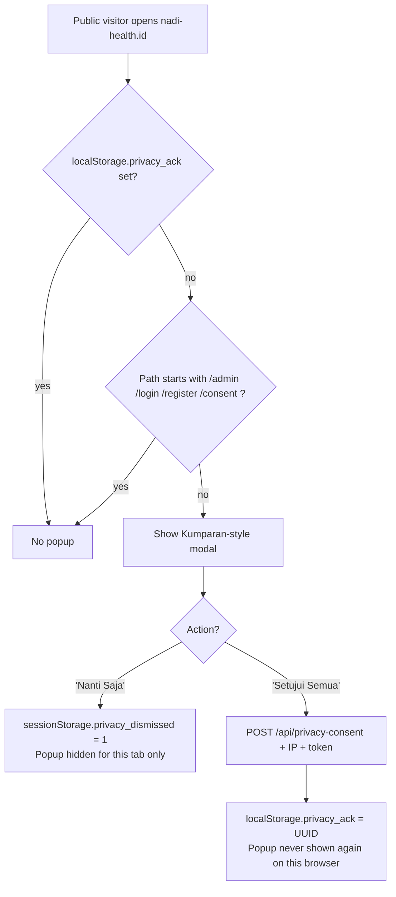

# NADI Article Workflow — Visual Documentation

End-to-end submission → review → publish flow, matched line-by-line to
`Workflow Website Article Submit - QC - Publish.pdf` (the canonical NADI
spec). Each diagram is followed by the code paths that implement it.

---

## State machine (overview)



Code paths:
- Enum: `src/data/articles/types.ts → ArticleStatus`
- Transition route: `src/app/api/articles/[slug]/transition/route.ts`
- Guards: `src/lib/permissions.ts` (canPublish / canReview / canEditOwnContent)

---

## Workflow 1 — Submit to QC

```mermaid
sequenceDiagram
    participant P as Partner
    participant FE as Web App
    participant API as /api/articles/*
    participant DB as Postgres
    participant MAIL as Email (notify.ts)
    participant A as Admin (WB / SA / Amira)

    P->>FE: Log in (/login)
    Note over FE: Privacy Popup<br/>(first visit only)
    P->>FE: Open /admin/articles/new
    P->>FE: Choose Policy Product Type<br/>(Opinion Piece / Policy Brief / Policy Paper)
    Note over FE: Dropdown shows short description<br/>per guideline; "📥 Download Guideline" link
    FE->>FE: Auto-seed editor scaffold<br/>(section headings + placeholder hints)
    P->>FE: Fill title, content, authorship ack, AI disclosure
    P->>FE: Click "Submit for Review"
    FE->>API: POST /api/articles<br/>(submit:true, policy_product_type, ack)
    API->>DB: INSERT articles status='in_review'
    API->>DB: INSERT submissions audit row
    API->>MAIL: notifyArticleSubmitted<br/>(to: admins+reviewers, CC: Amira/WB/SA)
    API->>MAIL: notifySubmissionReceived<br/>(to: partner only)
    API-->>FE: 201 Created
    MAIL-->>P: Email — "Thank you for submitting your work.<br/>We will review your work and get back<br/>to you in 7 days"
    MAIL-->>A: Email + standing CC — "New submission: <title>"

    A->>FE: Log in → /admin/review
    Note over FE: 3 buckets — 'Pending QC / Review' (this article)<br/>'Awaiting Consent Form' / 'Ready to Publish'
    A->>FE: Open article → read body → add comment
    FE->>API: POST /api/articles/[slug]/comments
    API->>DB: INSERT article_comments + flip articles.feedback_pending=true
    API->>MAIL: notifyFeedbackReceived (to: partner)
    MAIL-->>P: Email — "Your work has been reviewed.<br/>Please kindly proceed with the<br/>necessary revisions at your earliest convenience"
```

Code paths:
- Editor: `src/components/ArticleEditor.tsx` (PolicyProductPicker + TemplateScaffold + AuthorshipAck + AiDisclosureField)
- Picker data: `src/data/policy-products.ts` (verbatim from guideline.docx)
- Save: `src/app/api/articles/route.ts` POST → `saveArticle` in `src/lib/articles-store.ts`
- Submission email: `notifySubmissionReceived` + `notifyArticleSubmitted` in `src/lib/notify.ts`
- ETA days: `getReviewEtaDays()` reads `site_settings.review_eta_days` (default 7)
- CC list: `site_settings.notification_cc` (seeded with Amira/WB/SA, editable in /admin/settings)
- Comment thread: `src/components/CommentThread.tsx` mounted in `ArticleEditor` when `isEdit && slug`
- Review queue: `/admin/review` → `src/components/ReviewQueue.tsx`

---

## Workflow 2 — Revision to Approval



Code paths:
- "My Submissions" filter: `src/app/admin/articles/page.tsx` calls `getArticlesByAuthor` when role=partner
- Status badge + filter chips: `src/components/ArticleList.tsx`
- Feedback banner: `src/components/ArticleEditor.tsx` (renders when `feedback_pending` is true)
- Approve button: `src/components/ApproveButton.tsx`
- Approve transition: `src/app/api/articles/[slug]/transition/route.ts` action="approve"
- Token signing: `src/lib/consent-token.ts → signConsentToken`
- Approval email: `notifyArticleApproved` in `src/lib/notify.ts`

---

## Workflow 3 — Approval to Publish



Code paths:
- Consent token: `src/lib/consent-token.ts` (HMAC SHA-256 over slug+expiresMs)
- Consent page: `src/app/consent/[slug]/page.tsx` (token-gated public route, no auth)
- Done page: `src/app/consent/[slug]/done/page.tsx`
- Consent form: `src/components/ConsentForm.tsx` (split into Author Declarations 1-4 interactive + NADI Terms 5-6 locked)
- Consent API: `src/app/api/consent/[slug]/route.ts` (GET prefill, POST submit)
- Signature upload: `src/app/api/upload/signature/route.ts` (validateUpload preset)
- Admin viewer: `/admin/consents` + `/admin/consents/[id]` printable detail
- Resend link: `src/app/api/articles/[slug]/resend-consent/route.ts` (admin/reviewer convenience)
- Publish button: `src/components/PublishButton.tsx`
- Publish transition: `src/app/api/articles/[slug]/transition/route.ts` action="publish"

---

## Email matrix (verbatim PDF copy where given)

| Event | To | CC | Subject / body (verbatim) |
|---|---|---|---|
| Partner signs up | All admins | Standing CC | "New contributor signup: \<name\>" |
| Admin activates partner | The partner | — | "Your NADI account is now active" |
| **Article submitted** (partner-side auto-reply) | Partner | — | **"Thank you for submitting your work. We will review your work and get back to you in {X} days"** |
| **Article submitted** (admin notification) | Reviewers + admins | Standing CC | "Article submitted for review: \<title\>" |
| **Comment posted** (admin → partner) | Partner (article author) | — | **"Your work has been reviewed. Please kindly proceed with the necessary revisions at your earliest convenience"** |
| **Article approved** | Partner | Standing CC | **"Your work has been approved. Please kindly complete and submit the consent form for publication"** (+ consent-form link) |
| **Consent received** | Admins + reviewers | Standing CC | "Consent received: \<title\>" |
| **Article published** | Partner | Standing CC | "Your article is now live" |

Standing CC list = Amira / Widyaretna Buenastuti / Soleh Ayubi @inkemaris.com.
Editable in `/admin/settings → Notification CC list`.

Helper: every notify call is **fire-and-forget**. SMTP failures log via `console.error` and never block the request lifecycle. If `SMTP_HOST` and `SMTP_USER` aren't set, the helper falls back to `console.log` so dev mode keeps working.

---

## Privacy Policy popup (Annex)



Editable body in `/admin/settings → Privacy & Terms body`.
Component: `src/components/PrivacyPopup.tsx` + `PrivacyPopupGate.tsx` (suppression logic).

---

## Where this doc lives in the bigger picture

- **PLAN.md** — strategic scoping, phase order, open questions
- **PROGRESS.md** — implementation checklist (what's done vs deferred)
- **UAT.md** — 10 manual smoke-test scenarios for tester sign-off
- **WORKFLOW.md** (this file) — visual reference of the canonical PDF workflow

For step-by-step manual testing, see UAT.md. For the spec source, see the three artefacts in the repo root:
`Workflow Website Article Submit - QC - Publish.pdf`,
`NADI Policy Product Guideline and Templates.docx`,
`Consent-to-publish form.docx`.
